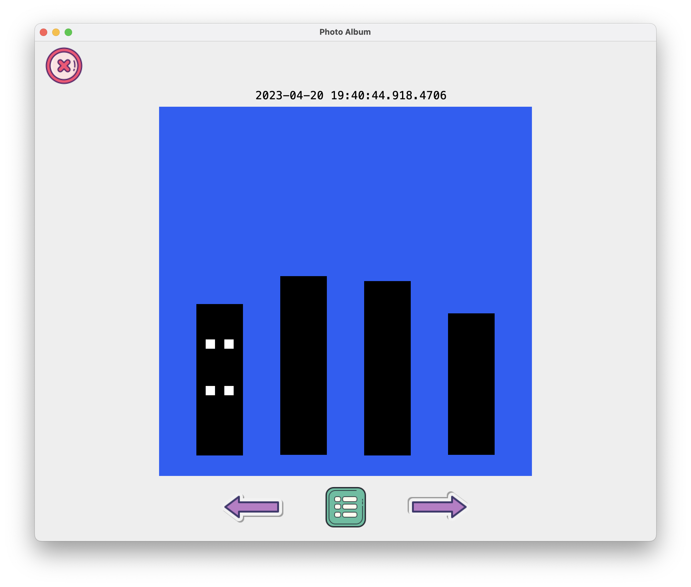
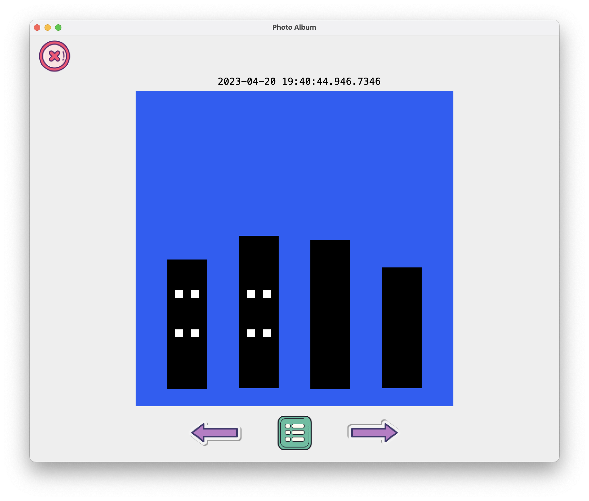
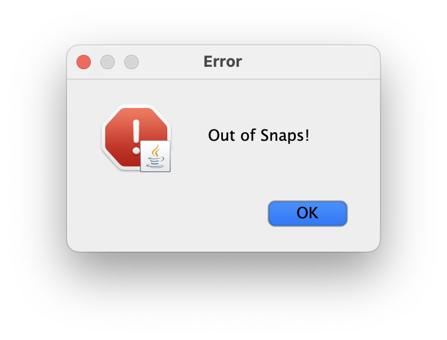
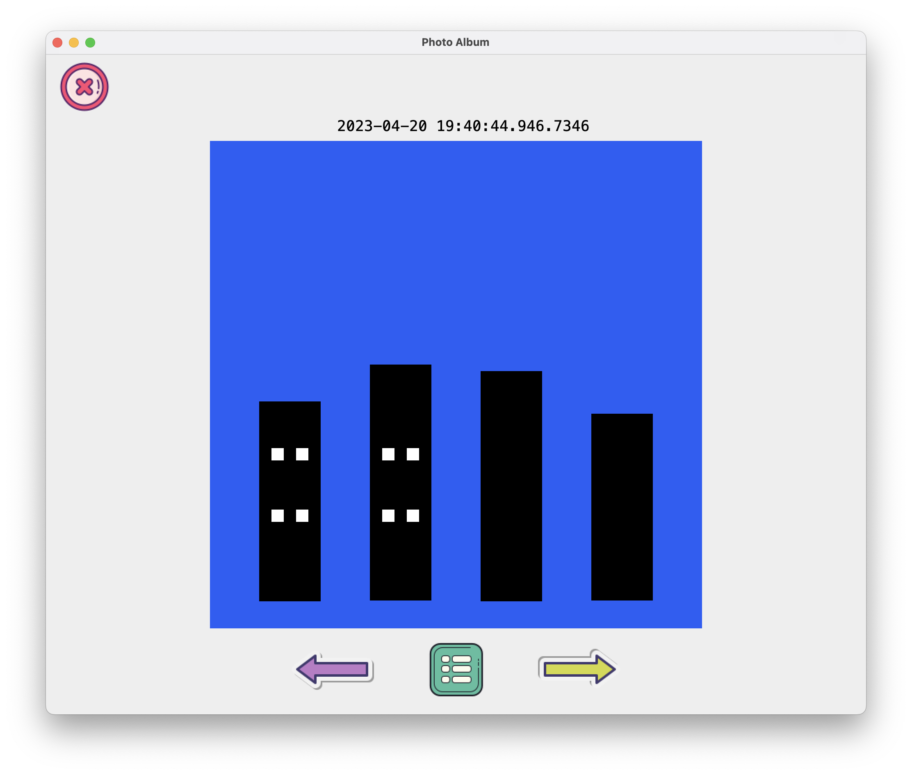
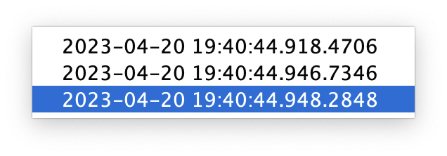
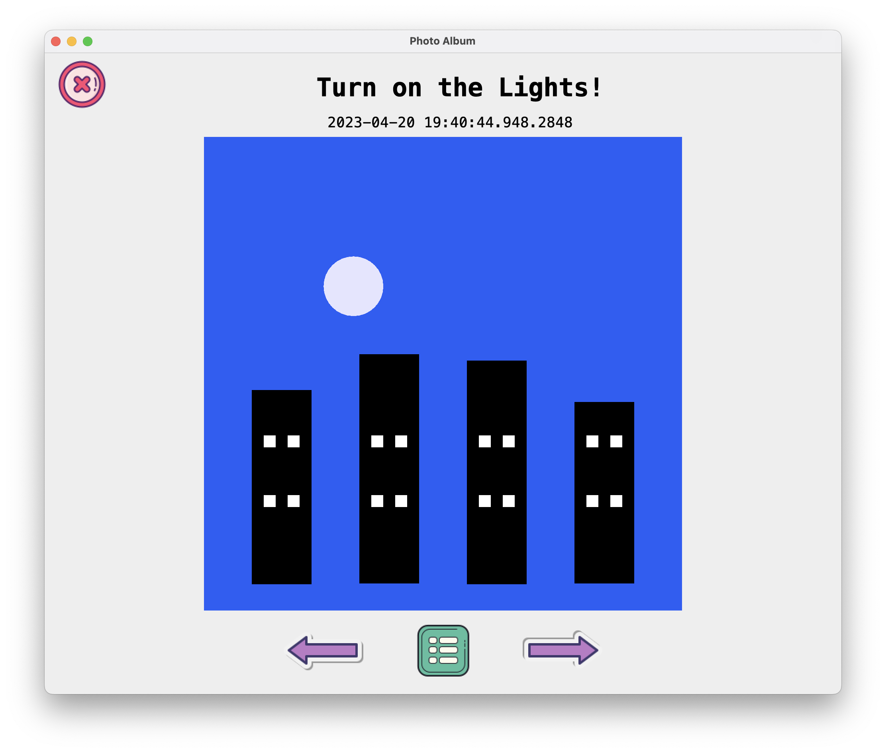

# Design Changes
- First change I realised I had to make was make my project more **SOLID Supportive**. I added **interfaces** for Model and Snapshot which allowed me to not be dependent on the implementation of the concrete classes and instead just maintain the contract between the 2 classes. 
- Secondly I **changed my Color class** choice from Java AWT's color to my own Color which extends AWT's color and implements my IColor. This way I am no longer violating the Liskov Substitution Principle and the Dependancy Inversion Principle.
- More **exceptions** were added to make errors for coherent.

# New Additions
- I added **2 Views, Graphical and Web** view which are implementing IView, and IGraphicalView and IWebView. T
- I am reading the **command line args** from the user, and then based on that I'm creating the correct view based on that. That way no extra view is created if it's not required.

# How MVC is working here
- The way my MVC communicate with each other is that the controller starts the application, creates a view and model. Passes a reference of itself to the view and the model.
- If any event occurs in the view, it lets the controller know and passes the event data to the controller.
- The controller checks what happened, and based on that, it asks the model to give the required data.
- Then the controller sends back the data to the view to change the UI. This is the main event loop.

# Factories
- For building SVG and HTML files, I used Factory Design Pattern which uses static methods and creates the required string commands.

# How to Run
### Static HTML
To check the static HTML page, just go to src/resources/ and Open the buildingsOut.html file in your browser. 

Command line args for web view:
```sql
-in src/resources/buildings.txt -out out.html -view web 800 800
```

### GUI App
To run the Graphical Interface, make a configuration with the command line as follows:
Put the required input file in the specified path: `src/resources/`
```sql
-in <inputfile-path> -view graphical 1000 1000
```

Example:
```sql
-in src/resources/buildings.txt -view graphical 1000 1000
```

# Sample Run of Graphical Interface
### First Load:


### Clicked Next:


### Clicked Next:


### Clicked Next (Out of Snapshots):


### Clicked Prev:


### Clicked Select:


### Reached Selected Snapshot:


# Sample Run of Web Interface
Please click here to see the web interface: https://neelthepatel8.github.io/cs5004-hw9/

# HW8 Previous Part:
# Design
For this project, I decided to use
the [MVC](https://en.wikipedia.org/wiki/Model%E2%80%93view%E2%80%93controller),
[Builder](https://en.wikipedia.org/wiki/Builder_pattern), and
[Command](https://en.wikipedia.org/wiki/Command_pattern) design patterns.

## MVC
The MVC design pattern is used to separate the model, view, and controller.
The model here is the PhotoAlbum. The model is going to communicate with the controller by using Commands.

## Command
The Command design pattern is used to encapsulate a request as an object. In this case the controller will create new Command objects, provide them with required parameters and then pass the object to the model. The model will then execute the command.

## Builder
For creating shapes, I went with the builder design pattern mainly because it is easy to use and it is easy to add new shapes. The builder pattern is used to separate the construction of a complex object from its representation. In this case, the builder will create a new shape and then return it to the model. The model will then add the shape to the list of shapes. The builder pattern basically allows me to just use one class for every shape kind and I set whatever value is required. Every other value is just set to a default empty/null/0.

# Classes
## Snapshots
The snapshots are stored in a hashmap with the key as the snapshot object and the value as the toString at that moment in time. This ensures that all the changes are recorded and preserved.

## Exceptions
Most validation should be done in the controller, so I haven't created a lot of exceptions yet. I have created a IllegalShapeException just to show how I will use more of them later on when I implement the controller.

### To String
The to Strings for the shapes checks for each value if it is empty or null, if it is actually set to something then it means it belongs to the shape, and it will be added to the string.

#### Sample Snapshot Output
```agsl
Snapshot ID: 2023-04-07 18:11:26.766.10650
Timestamp: 2023-04-07 18:11:26.766
Description: Changed color.
Shape Information: 
Name: circle1
| X: 10.0 | Y: 10.0 | Color: (0,0,255) | Radius: 30.0
```

## References

[Model](https://en.wikipedia.org/wiki/Model%E2%80%93view%E2%80%93controller)

[Builder Design Pattern](https://en.wikipedia.org/wiki/Builder_pattern)

[Command Design Pattern](https://en.wikipedia.org/wiki/Command_pattern)

[TutorialsPoint Builder Design Pattern](https://www.tutorialspoint.com/design_pattern/builder_pattern.htm)

[MVC](https://www.tutorialspoint.com/design_pattern/mvc_pattern.htm)

[Command](https://www.tutorialspoint.com/design_pattern/command_pattern.htm)